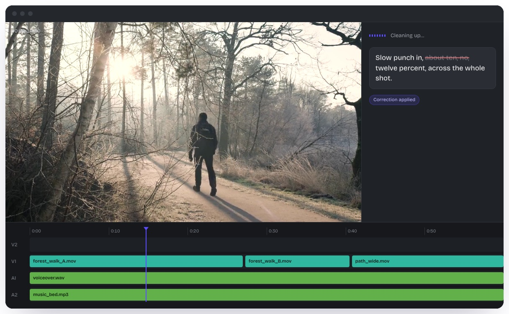
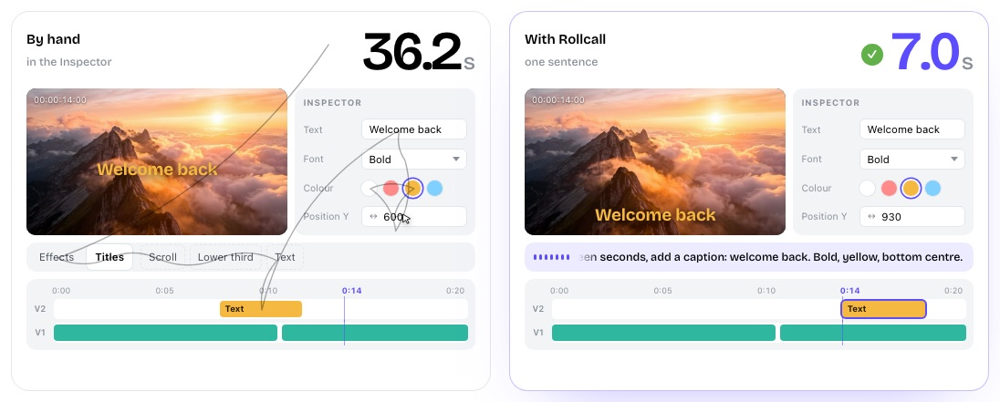
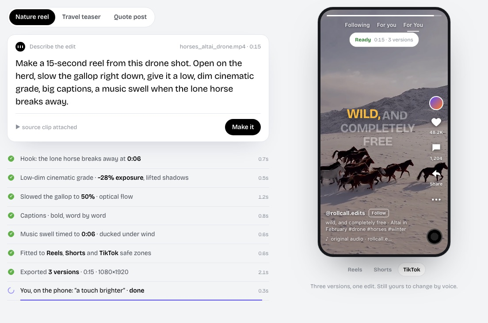
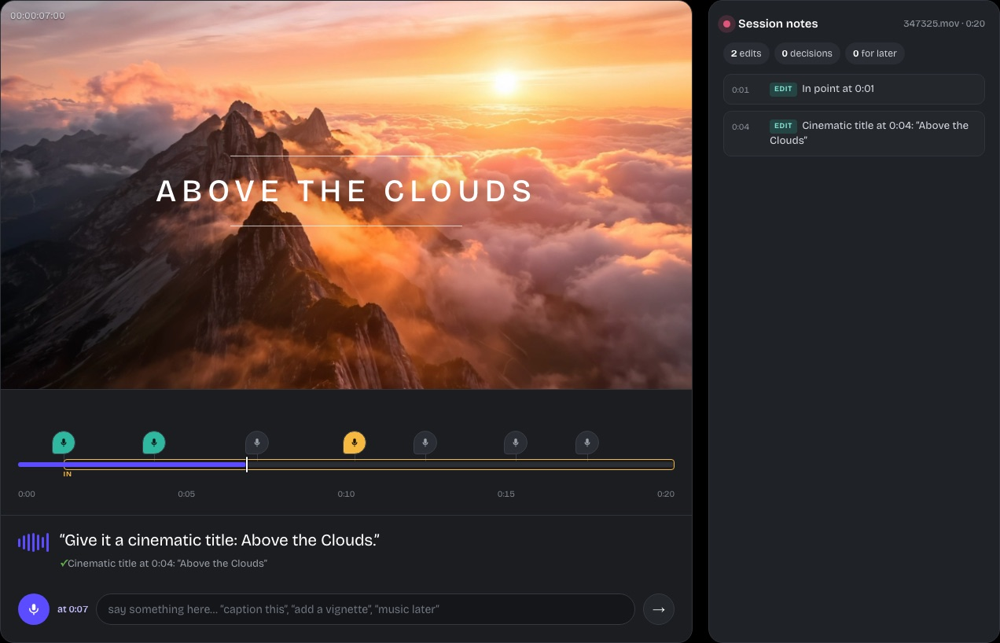
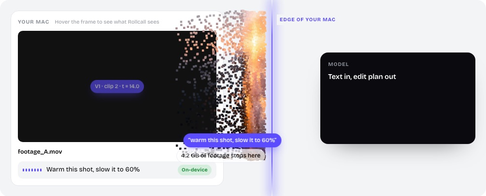
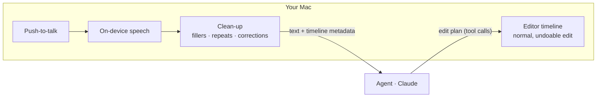

<p align="center">
  
</p>

<h1 align="center">Rollcall</h1>

<p align="center">
  <b>Edit video by talking to it.</b><br>
  A voice agent for macOS that works inside DaVinci Resolve, Premiere Pro and CapCut.
</p>

<p align="center">
  <a href="https://aman123lug.github.io/Rollcall-website/">Website</a> ·
  <a href="docs/ideas/">Ideas</a> ·
  <a href="docs/features/README.md">Features</a> ·
  <a href="#run-the-website">Run locally</a>
</p>

<p align="center">
  
</p>

---

## Say it. It lands on your timeline.

You talk the way you'd talk to an assistant editor. Rollcall cleans up the speech, turns it into a plan of real edits at real timecodes, and applies them through the editor's own scripting API. Every edit is a normal, undoable change in your project.

```text
You say     "Um, at fourteen seconds put a big title, start before you're ready,
             centre it, centre it, and make ready yellow, no, gold."

Rollcall    ✓ 00:14  Title "Start before you're ready." · centred · bold
            ✓        Highlight "ready" · #F5B841
            ↳ dropped: "um", repeated "centre it", "yellow"
```

<p align="center">
  
</p>

## What it does

<table>
  <tr>
    <td width="50%" valign="top">
      <br>
      <b>Faster than the menu</b><br>
      The same styled caption: <b>48 s and 9 clicks</b> by hand, <b>7 s and 0 clicks</b> by voice.
    </td>
    <td width="50%" valign="top">
      <br>
      <b>One prompt, a finished short</b><br>
      Hook, grade, retime, captions and music. Exported for Reels, Shorts and TikTok, still editable by voice.
    </td>
  </tr>
  <tr>
    <td width="50%" valign="top">
      <br>
      <b>Talk while it plays</b><br>
      Each command lands at the timecode you said it. Session notes track edits, decisions and to-dos.
    </td>
    <td width="50%" valign="top">
      <br>
      <b>Your footage stays on your Mac</b><br>
      Speech is transcribed on-device. Only command text and timeline metadata leave: <b>250 B</b> out of a 4.2 GB clip.
    </td>
  </tr>
</table>

## How it works



| Layer | Built with | Owns |
|---|---|---|
| **Mac app** | Swift · SwiftUI | Pill UI, push-to-talk hotkey, microphone, on-device speech, editor bridges |
| **Agent** | Go · Anthropic SDK tool runner | Turns the request and timeline state into tool calls: `addTitle`, `setSpeed`, `adjustColor`, … |
| **Editor bridges** | Each editor's scripting API | Resolve (Python/Lua), Premiere (UXP), CapCut (to be confirmed) |

No video or audio ever leaves the Mac.

## Use cases

| Say | Result |
|---|---|
| "Warm this shot, slow it to 60%." | Grade and retime the clip under the playhead |
| "Lower third at twenty, episode twelve." | Styled lower third at 0:20 |
| "Voice up a touch, music down under it." | VO +3 dB, music ducked −6 dB |
| "Caption this… add a vignette… music later." *(while playing)* | Three pinned commands, one saved for later |
| "Make a 15-second reel from this drone shot." | A finished short in three platform versions |
| "What can you do with this vlog?" | *Planned:* reads the footage, suggests styles, builds a layered first cut ([001](docs/ideas/001-agent-edit-from-footage.md)) |

## Roadmap

| Now (on the website) | Next | Ideas |
|---|---|---|
| Voice commands · filler clean-up · edit plans · timecode-pinned commands · session notes · one-prompt shorts | Final Cut Pro · After Effects · Descript | [Agent edit from footage](docs/ideas/001-agent-edit-from-footage.md) · [Client notes → edits](docs/ideas/002-client-notes-to-edits.md) · [Check before export](docs/ideas/003-check-before-export.md) · [React while you watch](docs/ideas/009-react-while-you-watch.md) · [all 15 →](docs/README.md) |

## Run the website

The site is one static page (`index.html`) with no build step and no dependencies.

```sh
python3 -m http.server 8000     # then open http://localhost:8000
```

Serve it rather than opening the file directly: the microphone demo and the canvas effects need `localhost` or `https`. A push to `main` deploys to GitHub Pages through [`.github/workflows/static.yml`](.github/workflows/static.yml).

```text
index.html          the site: markup, styles, scripts
videos/             demo footage and posters
docs/ideas/         one short file per use case (+ _template.md)
docs/features/      feature list and status
.github/            deploy workflow, README assets
```

**Before launch:** set `WAITLIST_ENDPOINT` in `index.html` (signups aren't stored until then), replace `hello@example.com` in the footer, and swap the placeholder quotes in Stories.

<p align="center"><sub>macOS first · Editor names belong to their owners; Rollcall is not affiliated with them.</sub></p>
